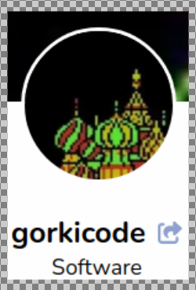

gorkiscript - My set of scripts and configurations for Manjaro (Arch Linux) brand new installations

## About gorkiscript

**gorkiscript** is a set of scripts and configurations for [Manjaro](https://manjaro.org/) with [XFCE4](https://manjaro.org/products/download/x86)

## Installation (one-liner)

*   `git clone https://github.com/gorkicode/gorkiscript.git && cd gorkiscript && makepkg -fic && cd .. && rm -rf gorkiscript`

## Features

*  /usr/share/gorkiscript/.gorkiscript_bash_aliases

    * BRAVE BROWSER: 
        * `bra [URL] [logt]`
        * (logt is a optional literal value to pop-up another parallel terminal with the LOG OUTPUT)

* /usr/share/gorkiscript/gorkiscript-autter.sh

    * Script loaded from XFCE4 autostart gorkiscript module
        * Shows last 33 lines $HOME/.bash_history

* /etc/xdg/autostart/gorkiscript-autter.desktop

    * XFCE4 autostart gorkiscript module for gorkiscript-autter.sh loading

---

## Donations

Please donate a little to support my projects:

